CUDA Path Tracer
================

**University of Pennsylvania, CIS 565: GPU Programming and Architecture, Project 3**

* Qingying Li
  * [LinkedIn](https://www.linkedin.com/in/harper-li-292730373/)
* Tested on: NVIDIA H200, Ubuntu 22.04 (Docker), CUDA 12.4

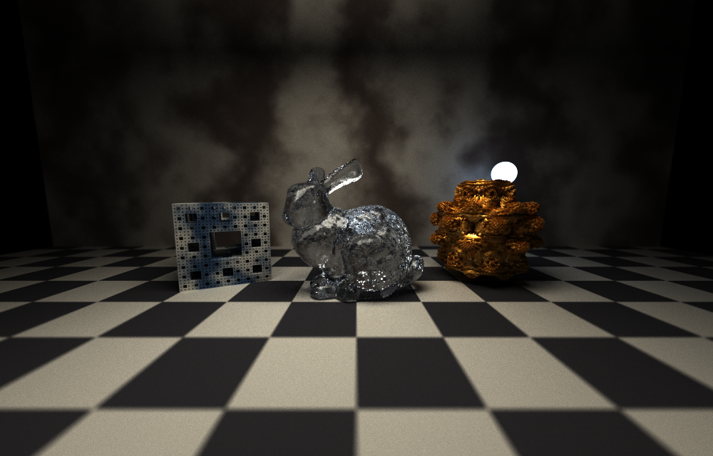

*Menger sponge with a marble texture, a glass Stanford bunny (69,451 triangles), and a gold Mandelbulb on a checker floor, with depth of field. 1000×640, 3000 samples per pixel. I stopped and resumed this render with checkpoints.*

## Features

* Diffuse, mirror, and glass materials (glass uses the full Fresnel equations)
* Stochastic antialiasing
* Stream compaction and material sorting (both can be turned off)
* Depth of field
* Russian roulette
* Direct lighting with multiple importance sampling (MIS)
* Motion blur
* Restartable rendering (save progress, stop, and continue later)
* Halton sampling
* Fog
* OBJ mesh loading, bounding-box culling, and a BVH
* Fractal shapes (Mandelbulb and Menger sponge) and procedural textures (checker and marble)

Every feature is turned on or off with an environment variable, so I can compare the same scene with and without it:

| Variable | What it does |
|---|---|
| `PROJECT3_HEADLESS=1` | Render without a window, save the image, and print the time per iteration |
| `PROJECT3_NO_ANTIALIAS=1` | Turn off antialiasing |
| `PROJECT3_SORT_MATERIALS=1` | Sort paths by material before shading |
| `PROJECT3_NO_COMPACTION=1` | Turn off stream compaction |
| `PROJECT3_RUSSIAN_ROULETTE=1` | Russian roulette after 3 bounces |
| `PROJECT3_DIRECT_LIGHTING=1` | Direct lighting with MIS |
| `PROJECT3_MOTION_BLUR=1` | Motion blur |
| `PROJECT3_HALTON=1` | Halton sampling |
| `PROJECT3_FOG=1` | Use the `Fog` block in the scene file |
| `PROJECT3_MESH_CULLING=1` | Test the mesh bounding box first |
| `PROJECT3_BVH=1` | Use the BVH |
| `PROJECT3_BVH_MAX_DEPTH=N` | Maximum BVH depth (default 32) |
| `PROJECT3_CHECKPOINT=file` | Save progress to this file, and continue from it next time |
| `PROJECT3_STOP_AFTER=N` | Stop after N iterations |
| `PROJECT3_PRINT_PATH_COUNTS=1` | Print how many paths are left after each bounce |

New scene file options:

* Camera: `APERTURE_RADIUS`, `FOCAL_DISTANCE`
* Objects: `VELOCITY`, and new types `mesh` (with `FILE`), `mandelbulb`, `menger`
* Materials: `TEXTURE` (`checker` or `marble`), `RGB2`, `TEXTURE_SCALE`
* `Fog` with `DENSITY` and `ALBEDO`

**How I measured.** All times are milliseconds per iteration in headless mode, measured with CUDA events. Each number is the median of 3 runs. Most settings varied by about 2% between runs, but a few varied more (up to 12% for material sorting in the Cornell box), so I don't read much into differences of a few percent. The server is shared, so I only timed on a GPU that nobody else was using. Scenes are 384×384 with depth 8 unless I say otherwise. Most numbers come from `tools/perf_all.sh`. The compaction on/off, depth of field, glass, and fractal comparisons I ran separately with the same settings.

---

## Core Renderer

### Diffuse Shading

Diffuse surfaces bounce rays in a cosine-weighted direction. With this sampling, the cosine and the pdf cancel out, so each bounce just multiplies the path color by the surface color.

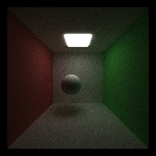

### Antialiasing

Each iteration shoots the camera ray through a random point inside the pixel instead of always the center. Averaged over many iterations, the edges come out smooth. It only costs two random numbers per ray. `PROJECT3_NO_ANTIALIAS=1` turns it off for comparison.

| Without antialiasing | With antialiasing |
|---|---|
| 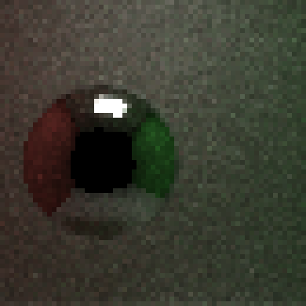 | 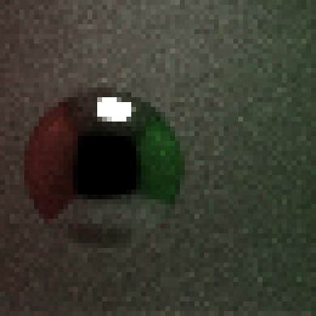 |

(Zoomed in on the sphere, 256×256, 256 samples.) Without it, the sphere's outline and the highlight are jagged no matter how many samples I take, because every sample goes through the same point.

### Stream Compaction

After each bounce, finished paths (they missed everything, hit a light, or ran out of bounces) are added to the image. Then `thrust::remove_if` removes them from the path array, so the next bounce only launches threads for paths that are still alive.

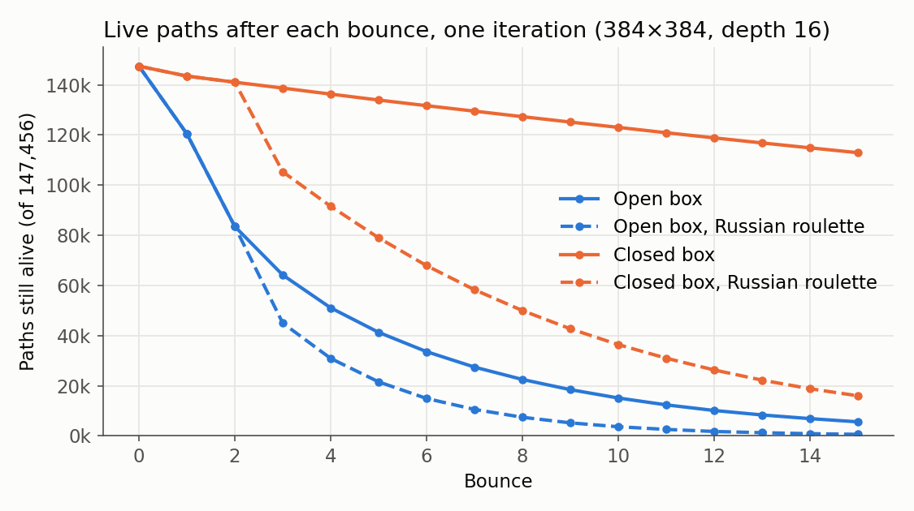

| Bounce | Open box | Closed box |
|---:|---:|---:|
| 0 | 147,456 | 147,456 |
| 1 | 120,436 | 143,496 |
| 2 | 83,494 | 141,058 |
| 4 | 51,054 | 136,310 |
| 8 | 22,486 | 127,310 |
| 12 | 10,114 | 118,853 |
| 15 | 5,580 | 112,939 |

(384×384, depth 16, one iteration.)

**Open vs. closed box.** In the open Cornell box, rays escape through the front, so only 15% of paths are left by bounce 8. In the closed box (I added a front wall and put the camera inside), nothing can escape. Paths only end when they hit the light, and 77% are still alive at bounce 15. That's why the closed box is slower: 3.28 ms vs 1.78 ms.

**Compaction on vs. off.** I added `PROJECT3_NO_COMPACTION=1` to compare. Without compaction, finished paths stay in the array and their threads just return right away. The image is exactly the same either way.

| Scene | Compaction on | Compaction off | Result |
|---|---:|---:|---|
| Open box, depth 8 | 1.18 | 1.14 | compaction 3% slower |
| Open box, depth 16 | 1.78 | 1.82 | compaction 2% faster |
| Closed box, depth 16 | 3.28 | 2.62 | compaction 25% slower |
| 69k-triangle bunny, BVH (256×256) | 2.45 | 2.24 | compaction 9% slower |
| 69k-triangle bunny, no BVH (256×256) | **207.8** | **341.1** | **compaction 39% faster** |

(The no-BVH bunny row is from a single run each, because every run takes a long time. The first two rows are within the normal run-to-run variation.)

I expected compaction to always help, but it doesn't. `remove_if` isn't free: every bounce it copies all live paths (64 bytes each), about 0.13 ms per iteration. In a simple scene, a finished thread costs almost nothing, because it reads its path and returns. So compaction only wins when each live path is expensive. In the bunny scene without a BVH, every thread loops over 69k triangles, and compaction saves 39%. The closed box is the worst case: most paths never finish, so compaction pays the copy cost every bounce and removes almost nothing.

To make compaction pay off more, I could compact only every few bounces, or only when enough paths have finished.

### Material Sorting

Before shading, I sort the paths by material with `thrust::sort_by_key`. The idea is that threads in the same warp then run the same material code.

| Scene | Not sorted | Sorted |
|---|---:|---:|
| Cornell box (5 materials) | 1.20 | 4.74 |
| Cover scene (7 materials, 400×256) | 23.29 | 30.92 |

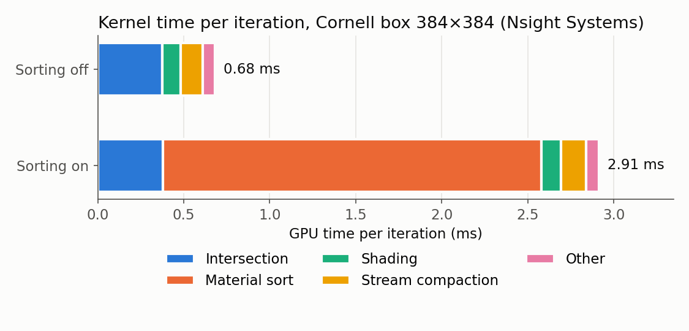

**Sorting made both scenes slower** (3.9× and 1.3×). The Nsight numbers explain it. Shading didn't get faster at all (0.109 → 0.115 ms, slightly slower), because my materials are all short, so there isn't much divergence to fix. But the sort itself takes 2.2 ms per iteration. I sort a whole struct with a custom compare function, so Thrust uses a merge sort instead of the much faster radix sort. It also has to move the 64-byte paths around.

Sorting would help if the materials were expensive and very different (like image textures). It would also be much cheaper to radix-sort just an integer material ID and use that to reorder the paths.

---

## Visual Features

### Refraction

Glass picks reflection or refraction for each sample, using the full Fresnel equations. When Snell's law has no answer, it's total internal reflection.

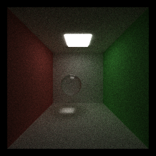

To check it, I wrote a small CUDA test (`tests/glass_scatter_tests.cu`) that calls `scatterRay` 100,000 times per case and checks the direction and color of every result:

```text
Normal incidence + Fresnel: PASS | reflected=4.163% | transmitted=95837 | errors=0
Air to glass at 30 degrees: PASS | reflected=4.118% | transmitted=95882 | errors=0
Glass to air at 30 degrees: PASS | reflected=5.438% | transmitted=94562 | errors=0
Total internal reflection at 50 degrees: PASS | reflected=100.000% | transmitted=0 | errors=0
ALL GLASS SCATTER TESTS PASSED
```

At normal incidence with IOR 1.5, about 4% should reflect, which matches.

* **Performance:** 1.21 ms with a glass sphere vs 1.18 ms with a diffuse one, about 2–3% slower. It's a few more instructions, and glass never absorbs light, so paths live a bit longer.
* **GPU vs. CPU:** Each path makes its own random choice, so it maps well to one thread per path. Threads in a warp that pick different branches wait for each other, which a CPU wouldn't have to do, but the branch is short.
* **Could be better:** rough glass, and dispersion (different IOR per wavelength).

### Depth of Field

The camera is a thin lens. For each ray, I find where it hits the focal plane, pick a random point on the lens (a disk of radius `APERTURE_RADIUS`), and shoot the ray from that point through the focal point. Things at the focal distance stay sharp, and everything else blurs.

| Pinhole | Aperture 0.6, focused on the middle sphere |
|---|---|
|  | 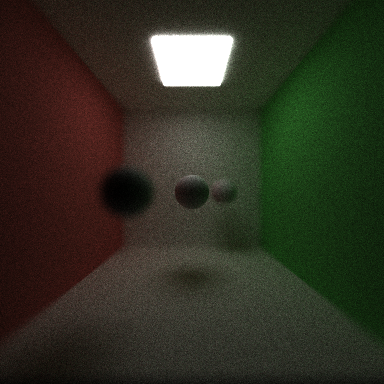 |

The spheres are 6, 9 and 12 units from the camera, and the focus is at 9. The front sphere blurs about twice as much as the back one, as expected (blur ∝ aperture × |distance − focus| / distance).

* **Performance:** 1.18 ms vs 1.17 ms, no measurable difference. It's two random numbers and a bit of math per camera ray.
* **GPU vs. CPU:** Every camera ray is independent with no branching, so it's a perfect fit for the GPU.
* **Could be better:** a hexagon-shaped lens for shaped bokeh, and autofocus on whatever is in the middle of the screen.

### Direct Lighting

At every diffuse hit, I send a shadow ray to a random point on a random light. If nothing blocks it, I add that light right away. The path then keeps bouncing as usual. If a bounced ray hits a light later, that light is counted too. To avoid counting it twice, both are weighted with MIS (the power heuristic from PBRT).

Two things went wrong on the way:

* **Fireflies.** My first version only sampled the light. The Cornell light is a thin box hanging a little below the ceiling, so ceiling points right next to it got huge contributions, and white dots appeared everywhere (see Bloopers). MIS fixed this.
* **1.2% too bright.** The shadow ray adds one more bounce, so on the last bounce it counted light from beyond the `DEPTH` limit. I now skip it on the last bounce.

**Is it correct?** I compared the average brightness against a 2048-sample render without direct lighting (256×256, depth 8):

| Scene | Reference | 512 spp, off | 512 spp, on |
|---|---:|---:|---:|
| Normal light | 0.1720 | 0.1720 | 0.1720 |
| Small light (1/9 area, same power) | 0.2232 | 0.2234 | 0.2231 |

**Noise** (RMSE against the reference, 8-bit):

| Scene | 64 spp off | 64 spp on | 512 spp off | 512 spp on |
|---|---:|---:|---:|---:|
| Normal light | 19.5 | 8.8 | 6.1 | 4.6 |
| Small light | 60.5 | 29.3 | 21.2 | 15.6 |

| Small light, 64 spp, off | Small light, 64 spp, on | Reference |
|---|---|---|
| 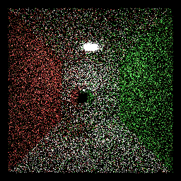 | 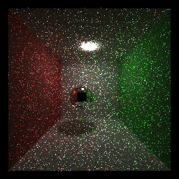 | 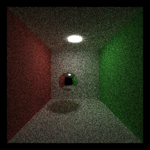 |

* **Performance:** 1.17 → 1.54 ms (+32%), because every diffuse hit traces one more ray. But the noise is cut about in half, which would otherwise take 4× the samples. Worth it.
* **GPU vs. CPU:** The shadow ray runs inside the shading kernel, so threads that hit different materials diverge. A CPU wouldn't have that problem, but it would trace the rays one at a time.
* **Could be better:** pick brighter lights more often, and trace shadow rays in their own kernel.

### Motion Blur

Objects can have a `VELOCITY`: how far they move while the shutter is open. Each path gets a random time between 0 and 1. When testing a moving object, I move the ray backwards by `velocity × time` instead of moving the object, so no matrices need to be rebuilt. Shadow rays use the same time, and textures move with the object.

| Motion blur off | Motion blur on |
|---|---|
| 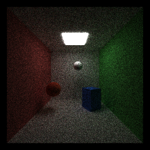 | 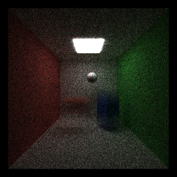 |

The red sphere moves sideways, the blue box moves up, and the white sphere doesn't move, so it stays sharp.

* **Performance:** 1.17 ms vs 1.16 ms, no measurable cost. It's one random number per path and one multiply-add per intersection test.
* **GPU vs. CPU:** Same work for every ray and no extra branches, so it runs just as well on the GPU.
* **Could be better:** rotating objects and curved motion.

### Fog

A scene can have `"Fog": {"DENSITY": σ, "ALBEDO": [r, g, b]}`. Each bounce, the path picks a random distance `-ln(1 - u) / σ`. If that distance is shorter than the distance to the next surface, the ray scatters inside the fog: it stops there, gets darker by the albedo, and continues in a random direction. With direct lighting on, shadow rays are also dimmed by the fog (`exp(-σ d)`).

| No fog | Fog (σ = 0.08) | Fog + direct lighting |
|---|---|---|
| 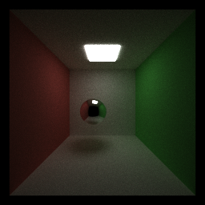 | 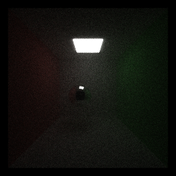 | 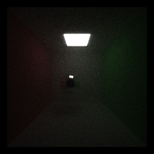 |

To check the shadow-ray part, I compared the fog scene with and without direct lighting: the average brightness is 0.08657 vs 0.08654, the same.

* **Performance:** 1.50 ms without fog and 1.37 ms with fog, so the fog scene is actually faster. Many paths lose their energy in the fog or scatter before reaching the far walls, so they end sooner.
* **GPU vs. CPU:** Some threads in a warp scatter in the fog while others hit a surface, so there's some divergence.
* **Could be better:** send shadow rays from points inside the fog too (visible light beams would appear much faster), and fog that isn't the same density everywhere.

### Halton Sampling

With `PROJECT3_HALTON=1`, the first random numbers of each path come from a Halton sequence instead of the random generator. Halton points spread out more evenly, so they should cover the pixel better. I use them for the pixel position, the lens, the time, and the first 4 bounce directions (13 numbers). Each pixel shifts its points by its own random offset, so neighbouring pixels don't all make the same pattern.

Error against a 4096-sample reference (Cornell box, 256×256):

| Samples | Random | Halton | Change |
|---:|---:|---:|---:|
| 16 | 39.0 | 41.0 | +5% |
| 64 | 19.7 | 18.3 | −7% |
| 256 | 9.6 | 8.6 | −10% |

It helps, but only a little, and more at higher sample counts. I think it's small because later bounces and the light sampling still use normal random numbers.

* **Performance:** 1.18 ms vs 1.19 ms, no difference.
* **GPU vs. CPU:** Each number only depends on the pixel, the iteration, and the dimension, so threads don't share anything. Good fit for the GPU.
* **Could be better:** Sobol points, which work better than Halton in higher dimensions, and using them for light sampling too.

---

## Meshes

### OBJ Loading

Objects of type `mesh` load an OBJ file. I wrote a small loader that reads vertices (`v`) and faces (`f`), handles the different face formats (`7`, `7/2`, `7//3`, `7/2/3`) and negative indices, and splits polygons into triangles. The triangle test is two-sided, so meshes can also be glass.

### Bounding-Box Culling and BVH

There are three ways to intersect a mesh:

1. **Naive:** test every triangle.
2. **Bounding box** (`PROJECT3_MESH_CULLING=1`): test the mesh's bounding box first, and skip the mesh if the ray misses it.
3. **BVH** (`PROJECT3_BVH=1`): a tree of boxes built on the CPU when the scene loads. Each node splits its triangles in half along its longest side, and leaves hold up to 4 triangles. The GPU walks the tree with a small stack and skips any box that is farther than the closest hit so far.

All three give exactly the same image.

| Mesh | Triangles | Naive | Box culling | BVH |
|---|---:|---:|---:|---:|
| Bunny | 4,968 | 15.9 | 14.4 | 1.88 |
| Bunny (full) | 69,451 | 207.9 | 185.8 | 2.44 |

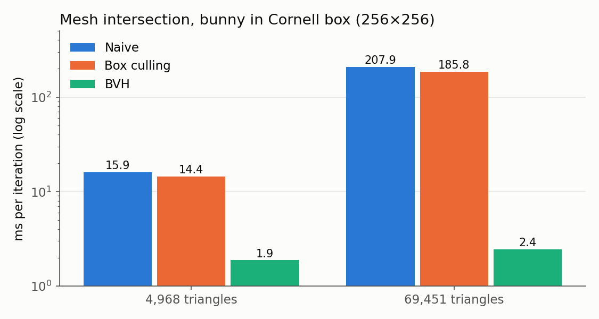

The BVH is 8.5× faster on the small bunny and **85× faster** on the big one. With 14× more triangles, the BVH only gets a little slower (1.88 → 2.44 ms), while the naive version gets 13× slower. Box culling only saves about 10%, because inside a room most bouncing rays still pass through the bunny's box.

**BVH depth.** I also tried limiting how deep the tree can go:

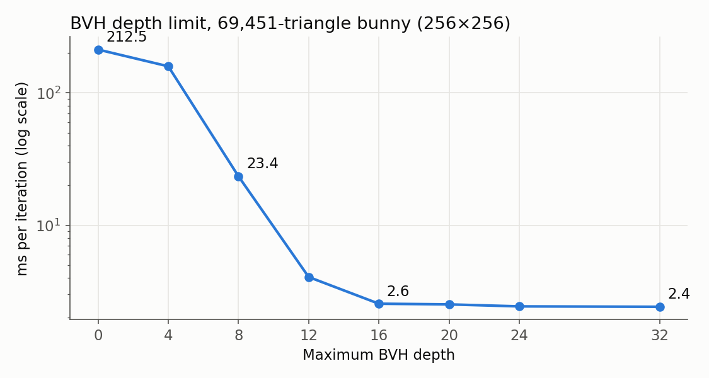

Depth 0 is one big leaf with every triangle, so it's the same as naive. It gets much faster up to about depth 16. After that nothing changes, because the leaves already have 4 or fewer triangles.

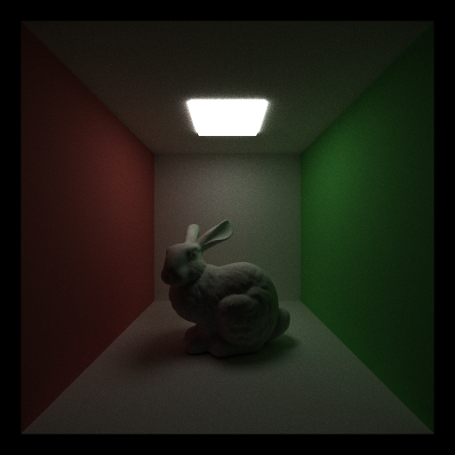

* **Why it's faster:** without a BVH, a ray near the bunny tests all 69k triangles. With it, the ray only tests a few dozen boxes and a handful of triangles.
* **GPU vs. CPU:** Building the tree is done once on the CPU. On the GPU, neighbouring rays go down different branches of the tree, so there's divergence, and the stack lives in slow local memory. But thousands of rays walk the tree at the same time, which a CPU can't do.
* **Could be better:** a better split rule (SAH), visiting the closer child first, and one BVH for the whole scene instead of one per mesh.

The bunny models come from the Stanford 3D Scanning Repository (see Credits).

---

## Fractals and Procedural Textures

### Fractal Shapes

These two shapes have no triangles. They're defined by a distance function: for any point, it tells how far away the surface is. I find the hit by stepping along the ray by that distance until I'm very close to the surface (sphere tracing).

* **Mandelbulb** (`"TYPE": "mandelbulb"`): a 3D version of the Mandelbrot set.
* **Menger sponge** (`"TYPE": "menger"`): a cube with square holes cut out, 4 levels deep. I split the cube into cells at each level and cut a square hole through the middle third of every cell along x, y and z, following the definition on [Wikipedia](https://en.wikipedia.org/wiki/Menger_sponge).

The normal comes from the slope of the distance function. It also works from inside the shape, so both shapes can be glass.

The Mandelbulb looks dark even under a bright light. I checked whether this was a bug: a random bounce from its surface hits the bulb again 58% of the time, while the same test on a plain sphere gives 0%. So the darkness is real. The surface is full of tiny cracks that block the light.

### Procedural Textures

Materials can have a texture computed from the 3D position of the hit point:

* **Checker** (`"TEXTURE": "checker"`): 3D squares that alternate between `RGB` and `RGB2`.
* **Marble** (`"TEXTURE": "marble"`): stripes bent by noise, blending `RGB2` into `RGB`.

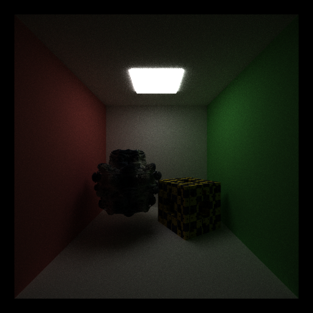

* **Performance:** this scene takes 51.7 ms. If I replace the fractals with a plain sphere and cube, it takes 1.68 ms, so the fractals are about 31× slower. Each ray can take up to 256 steps, and every Mandelbulb step has 8 rounds of `powf`, `acosf`, and `atan2f`. Rays that miss the bounding sphere skip all of this.
* **GPU vs. CPU:** Some rays need many more steps than others (rays that graze the surface take tiny steps), so each warp waits for its slowest ray. On the other hand, it's all math with no memory reads, which GPUs are good at.
* **Could be better:** bigger steps when far from the surface, and faster math functions like `__powf`.

---

## Performance Features

### Russian Roulette

From the third bounce on, a path survives with probability p = its brightest color channel (at most 1). If it survives, I divide its color by p. On average the image stays the same, but dim paths end early.

| Scene | Off | On | Faster by | Brightness off | Brightness on |
|---|---:|---:|---:|---:|---:|
| Open box | 1.78 | 1.64 | 7.8% | 0.17804 | 0.17803 |
| Closed box | 3.28 | 2.26 | 31.0% | 0.46818 | 0.46819 |

(384×384, depth 16.) The average brightness is the same, so Russian roulette doesn't change the image.

The closed box gains much more, because without Russian roulette 77% of its paths are still alive at bounce 15. With it, only 11% are.

| Bounce | Open, off | Open, on | Closed, off | Closed, on |
|---:|---:|---:|---:|---:|
| 0 | 147,456 | 147,456 | 147,456 | 147,456 |
| 3 | 64,147 | 44,985 | 138,711 | 105,308 |
| 6 | 33,579 | 14,909 | 131,689 | 67,889 |
| 9 | 18,419 | 5,177 | 125,157 | 42,699 |
| 12 | 10,114 | 1,743 | 118,853 | 26,280 |
| 15 | 5,580 | 602 | 112,939 | 15,967 |

| Off | On |
|---|---|
|  | 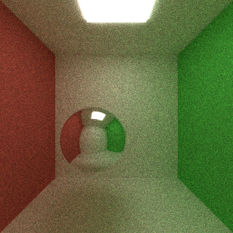 |

* **GPU vs. CPU:** On a CPU, ending a path saves time right away. On the GPU it only saves time once stream compaction removes the path; otherwise the thread still takes up a slot in its warp.
* **Could be better:** start it earlier for very dim paths, or never let the survival chance get too small, which would reduce noise.

### Restartable Rendering

With `PROJECT3_CHECKPOINT=file`, the renderer saves the image, the iteration count, and the camera every 64 iterations. It also saves when I stop it early: with `PROJECT3_STOP_AFTER`, with Ctrl-C, or with Esc or C in the window. Next time I run it with the same file, it continues where it stopped. It writes to a temporary file first and then renames it, so a crash in the middle of saving can't break the checkpoint.

Because the random numbers are seeded from the iteration number, a resumed render isn't just close to a normal one. It's exactly the same, down to every byte:

```text
=== one run, 300 iterations ===
Mean radiance: 0.18446 0.18563 0.14587
=== stop after 100, then resume ===
Stopped at iteration 100, checkpoint saved to results/ck-check-4Beymr/resumed.ckpt
Resuming from iteration 100
Mean radiance: 0.18446 0.18563 0.14587
=== Ctrl-C after 3 seconds, then resume ===
Stopped at iteration 36, checkpoint saved to results/ck-check-4Beymr/interrupted.ckpt
Resuming from iteration 36
Mean radiance: 0.18446 0.18563 0.14587
=== image checksums ===
71e68899cfdfe56c206016a9b0f26daf  interrupted.2026-09-30_19-09-07z.300samp.png
71e68899cfdfe56c206016a9b0f26daf  resumed.2026-09-30_19-08-48z.300samp.png
71e68899cfdfe56c206016a9b0f26daf  straight.2026-09-30_19-08-17z.300samp.png
```

* **Performance:** a checkpoint for a 384×384 image is 1.7 MB and is written from a copy the renderer already keeps on the CPU, so saving costs almost nothing.
* **GPU vs. CPU:** Only the image lives on the GPU, and it's copied back once when resuming. A CPU renderer would work the same way.
* **Could be better:** also save the BVH, so big meshes don't have to be rebuilt.

---

## Build Notes

I made two changes to `CMakeLists.txt` besides the source list:

* `CUDA_ARCHITECTURES native` → `CUDA_ARCHITECTURES 90`. In my Docker container, nvcc couldn't detect the GPU and quietly compiled for an old architecture instead. At one point this caused a link error, because some files were built for one architecture and some for another. Setting it to 90 (the H200) fixed it. On a different GPU, change 90 to that GPU's compute capability.
* Removed `-src-in-ptx` from the two `target_compile_options` lines (`-G` and `-lineinfo` are still there). With it, `ptxas` failed with `fatal: Parsing error ... syntax error` on `interactions.ptx`. The same file compiled fine without the flag. It only embeds source code as comments in the PTX, so removing it doesn't change the program.

`tests/glass_scatter_tests.cu` is built separately with nvcc.

```bash
cmake -S . -B build -DCMAKE_BUILD_TYPE=Release
cmake --build build -j
PROJECT3_HEADLESS=1 ./build/bin/cis565_path_tracer scenes/cornell.json
```

## Bloopers

| | |
|---|---|
| 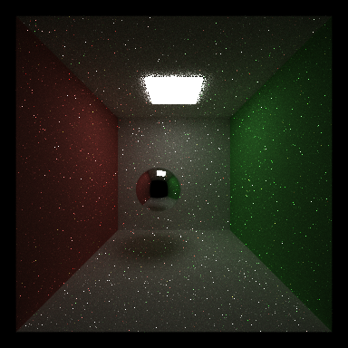 | **Fireflies.** My first direct lighting only sampled the light. Ceiling points right next to the light got huge values, and they spread through the room as white dots. MIS fixed it. |

Two bugs I found by checking numbers:

* **1.2% too bright.** The direct lighting image looked fine, but its average brightness was always 1.2% higher than the reference, at both 64 and 512 samples. Noise wouldn't be the same every time, so it had to be a real bug: light from one bounce past the depth limit.
* **Wrong GPU architecture.** A strange link error turned out to be files compiled for two different GPU architectures (see Build Notes).

## Credits

* Stanford bunny. Source: Stanford University Computer Graphics Laboratory, from the [Stanford 3D Scanning Repository](https://graphics.stanford.edu/data/3Dscanrep/). I used the [4,968-triangle version](https://graphics.stanford.edu/~mdfisher/Data/Meshes/bunny.obj) and the [full version](https://github.com/alecjacobson/common-3d-test-models).
* Menger sponge definition: [Wikipedia](https://en.wikipedia.org/wiki/Menger_sponge). The Mandelbulb uses its standard distance estimate formula.
* The rest follows [PBRT](https://pbr-book.org/) and the course slides.

I didn't use any third-party code besides the base code and Thrust.
